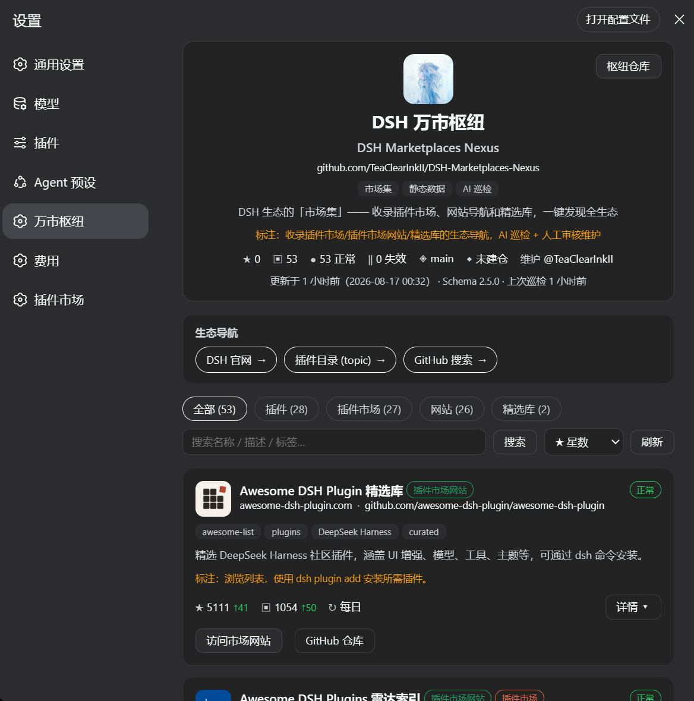

# DSH 万市枢纽（DSH Marketplaces Nexus）

> DSH 生态的「市场集」—— 收录插件市场、网站导航和精选库，一键发现全生态。
> 数据由**全自动流水线**维护：多源发现 → AI 初筛（排除名单）→ 自动收录 → AI 修正 → 数值刷新。

## 项目定位

- **只收录市场级资源**：插件市场、插件市场网站、精选库；不直接收录单个插件。
- **零 API 限额风险**：数据基于 GitHub 静态 JSON 存储。
- **全自动维护**：AI 负责发现、初筛、收录与修正，脚本刷新数值；人工只需处理 AI 标记的 `manual_request` 建议项。
- **开箱即用的面板**：DSH 插件形态的市场面板，供 DSH 用户发现和选择插件源。

## 界面



```sh
# 安装
dsh plugin --profile web update dsh-marketplaces-nexus

```

## 数据文件

| 文件 | 说明 |
| :--- | :--- |
| `docs/marketplaces.json` | 完整市场列表（Schema v2.5.0，id 为 m-XXXX 编号） |
| `docs/summary.json` | 统计摘要，用于面板快速加载 |
| `schema/schema.json` | JSON Schema 定义（v2.5.0） |
| `data/` | 流水线中间产物（排除名单/待复核/失败队列/变更日志，不发布） |
| `plugin/` | 可发布的 DSH 面板插件（npm bundle 包） |
| `collector/` | 全自动流水线（pipeline.py 一键执行） |

### 数据加载

- 面板数据源：`https://raw.githubusercontent.com/TeaClearInkII/DSH-Marketplaces-Nexus/main/docs/marketplaces.json`（插件内固定，可被用户配置 `dataUrl` 覆盖）

## 市场分类（categories）

一条目可同时属于多个分类（`categories` 数组，第一个为主分类）；`summary.by_category` 为分类出现次数，其总和可大于市场总数。

| 分类 | 含义 |
| :--- | :--- |
| `plugin` | 插件（会话内搜索/发现类） |
| `marketplace` | 插件市场（DSH 内安装的市场） |
| `website` | 插件市场网站（独立发现站） |
| `library` | 精选库（awesome 类目录） |

## 自动维护流程

```
pipeline.py（一键）
├─ 0 环境检查：token / DeepSeek 余额 / GitHub 限流 / 防并发锁
├─ 1 多源发现：GitHub 搜索 + awesome 精选库 json + 本仓库 Issues 建议
├─ 2 AI 初筛：market/maybe/plugin 分类 + 置信度 → 排除名单（3 次稳定）/ 待复核池
├─ 3 自动收录：market ≥0.85 入库（编号 id + identifier 去重）
├─ 4 AI 修正：白名单字段 + 防震荡 + 简介禁数字 + npm 包名校验 + manual_request
├─ 5 数值刷新：stars / pushed_at / README 链接数 / 网站统计 / summary
└─ 6 报告：变更日志 + 成本合计 + 失败通知
```

- **排除名单**：AI 连续 3 次判定单插件 → 稳定排除（不再复核）；星数翻倍强制重评；误判可经 CLI 菜单恢复。
- **失败队列**：网络/AI 失败自动记录，连续失败自动暂停重试；成功自动清除。
- **断点续跑**：异常中断后重跑自动从断点继续。
- **manual_request**：AI 拿不准的字段标记为「建议人工处理」，流水线跳过该条目自动修正，处理后删除标记即恢复。
- **回滚**：所有变更记录在 `data/changelog.jsonl`；数据文件有 git 历史 + `.bak` 备份。

## 快速开始

```sh
# 全自动流水线（推荐入口：主菜单）
python collector/pipeline.py
# 或直接执行
python collector/pipeline.py run

# CLI 菜单：排除名单 / 待复核 / 失败队列 / 配置 / 报告 / 推送
python collector/pipeline.py menu
python collector/pipeline.py push     # git 提交推送

# 配置（写入 .env）
python collector/pipeline.py --set AI_MAX_CALLS=30
```

环境要求：Python 3.9+（标准库）、`GITHUB_TOKEN`、`DEEPSEEK_API_KEY`（`.env` 或环境变量）。详见 [collector/README.md](collector/README.md) 与 [docs/PIPELINE.md](docs/PIPELINE.md)。

## 贡献

见 [CONTRIBUTING.md](CONTRIBUTING.md)——推荐新市场直接提交 Issue（自动进入候选池），数据无需人工 PR。

## 目录结构

```
.
├── docs/                  # 发布数据（marketplaces.json + summary.json + PIPELINE.md）
├── schema/                # JSON Schema v2.5.0
├── data/                  # 流水线中间产物（不发布）
├── collector/             # 流水线脚本（pipeline.py 一键；collect/merge/update/ai_extract 复用）
├── plugin/                # 可发布 DSH 面板插件（dsh.bundle.patch 声明）
├── .github/               # Issue 模板（ADD_MARKET）
└── archive/               # 归档（历史文档 / 旧管理台，不提交）
```
