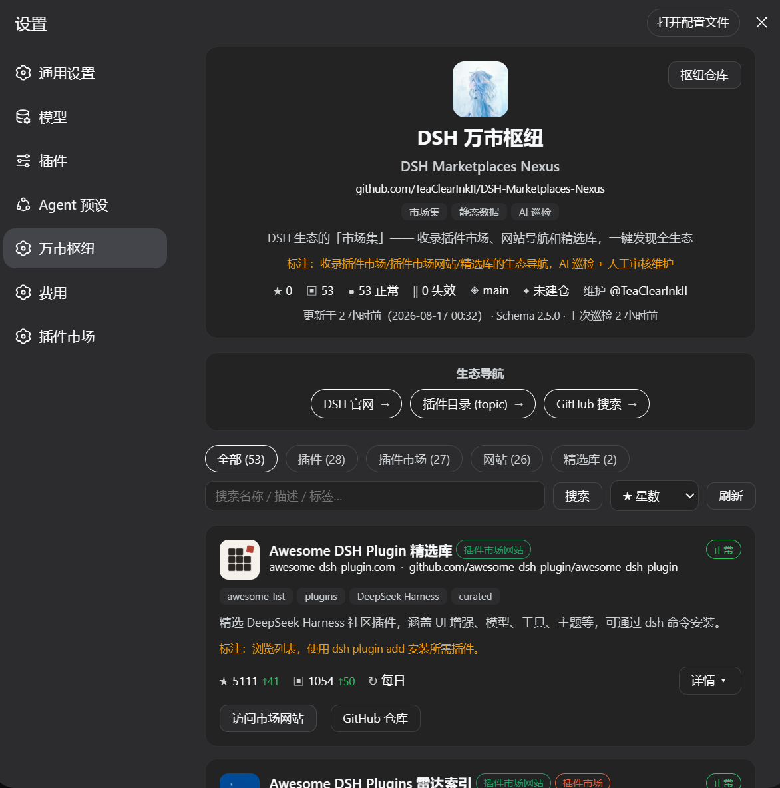

# DSH 万市枢纽插件包

DSH 生态「市场集」面板插件：在 DSH Web 设置页添加「万市枢纽」页面，聚合展示插件市场、插件市场网站与精选库，支持搜索、筛选与排序。

## 界面



## 功能

- **市场浏览**：40+ 市场条目卡片（分类/状态徽章、地址、标签、简介、标注、趋势、详情展开）
- **筛选与搜索**：分类 chips（插件/插件市场/网站/精选库）、关键词搜索（按钮/回车）、排序（星数/条目数/名称）
- **本仓库信息卡**：居中头像 + 标题、仓库名、仓库地址、标签、标注、hub 星数、收录规模、数据版本、过期提示、数据源
- **生态导航**：DSH 官网、插件目录（topic）、GitHub 搜索等快捷链接（居中）
- **安装管理**（仅 plugin/marketplace 类）：一键显示 `dsh plugin` 安装命令并复制，手动在终端执行（npm 发布版不执行自动安装，保证任何环境可加载）

## 常用命令

```sh
# 安装（首次）
dsh plugin --profile web add dsh-marketplaces-nexus

# 更新（拉取 npm 最新版本）
dsh plugin --profile web update dsh-marketplaces-nexus

# 启用/禁用（DSH 无原生 enable/disable 命令，通过配置行 disabled 标记切换）
# 在 <profile>/cordis.patch.yml 中添加以下内容禁用：
#   - id: nexus-market-panel
#     name: dsh-marketplaces-nexus
#     disabled: true
# 删除 disabled 行即恢复启用（改完重启 DSH 生效）

# 卸载
dsh plugin --profile web remove dsh-marketplaces-nexus
```

> 安装/更新/卸载后均需重启 DSH 生效（bundle patch 由 bundle 层在启动时应用）。
> 更新仅需 `update` 命令：数据不随 npm 包发布，面板自动拉取远程最新数据。

## 目录结构

```
plugin/
├── package.json         # bundle 声明：dsh.bundle.patch + dsh.client
├── cordis.patch.yml     # 插件行（纯 insert：id: nexus-market-panel）
├── 界面.png             # 界面截图
└── src/
    ├── index.js         # Host 侧：空插件（功能全部在 client 侧）
    └── client.js        # Client 侧：设置页 UI（__ModuleLoader__ bundle）
```

## 安装

```sh
# 本地源码安装（开发）
dsh plugin --profile web add ./plugin

# 或从 npm 安装（发布后）
dsh plugin --profile web add dsh-marketplaces-nexus
```

安装后重启 DSH，进入 设置 → 万市枢纽。

## 数据源

- **远程 URL**：`https://raw.githubusercontent.com/TeaClearInkII/DSH-Marketplaces-Nexus/main/docs/marketplaces.json`（默认数据源，随仓库推送自动更新）
- npm 包**不携带数据快照**（`files` 不含 `docs/`）：数据更新只需推送 GitHub 仓库，安装者的面板自动拉取最新远程数据，**无需重新 npm publish**；`npm publish` 仅在**面板代码变更**时执行。

可通过插件配置覆盖远程地址：

```yaml
# 用户 cordis.patch.yml
- id: nexus-market-panel
  name: dsh-marketplaces-nexus
  config:
    dataUrl: https://raw.githubusercontent.com/TeaClearInkII/DSH-Marketplaces-Nexus/main/docs/marketplaces.json
```

## 发布

1. 更新 `package.json` 版本号（仅面板代码变更时）
2. `npm publish`
3. 用户 `dsh plugin --profile web update dsh-marketplaces-nexus`

## 开发

- 数据 Schema：仓库根 `schema/schema.json`（v2.5.0）
- 数据维护：全自动流水线 `python collector/pipeline.py`（见 `docs/PIPELINE.md`）
- 修改后本地验证：直接编辑 `src/` 并通过 `dsh plugin --profile web add ./plugin` 重新安装
